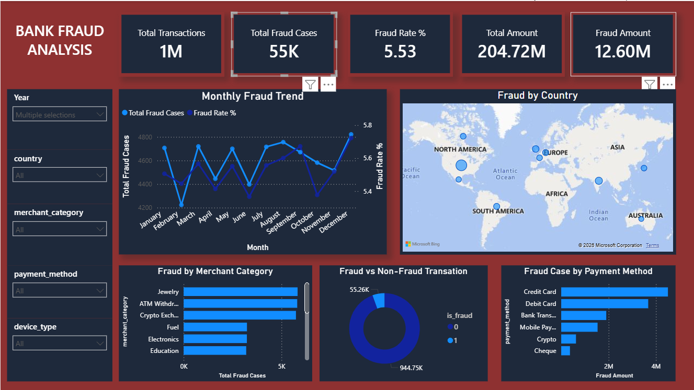

# Bank-Fraud-Analysis-PowerBI
Interactive Bank Fraud Analysis Dashboard built using Power BI to analyze fraud trends, transaction amounts, payment methods, merchant categories, and countries.
# 🏦 Bank Fraud Analysis – Power BI Dashboard

## 📊 Project Overview

Bank Fraud Analysis is an interactive Power BI dashboard designed to analyze fraudulent banking transactions and identify important fraud patterns.

The dashboard provides insights into fraud cases, fraud rates, transaction amounts, payment methods, merchant categories, countries, and monthly fraud trends.

---

## 🎯 Objectives

- Analyze total transactions and fraud cases
- Calculate overall fraud rate
- Monitor monthly fraud trends
- Identify fraud by country
- Analyze fraud by merchant category
- Compare fraud vs non-fraud transactions
- Identify high-risk payment methods
- Analyze fraud transaction amounts

---

## 🛠️ Tools & Technologies

- Power BI
- Power Query
- DAX
- Microsoft Excel / CSV
- Data Cleaning
- Data Visualization

---

## 📌 Key KPIs

| KPI | Value |
|---|---:|
| Total Transactions | 1M |
| Total Fraud Cases | 55K |
| Fraud Rate | 5.53% |
| Total Amount | 204.72M |
| Fraud Amount | 12.60M |

---

## 📈 Dashboard Features

### Monthly Fraud Trend
Shows the monthly variation in:

- Total Fraud Cases
- Fraud Rate %

### Fraud by Country
Geographical visualization showing fraud cases across different countries.

### Fraud by Merchant Category
Identifies merchant categories with higher numbers of fraudulent transactions.

### Fraud vs Non-Fraud Transactions
Compares fraudulent and non-fraudulent transactions using a donut chart.

### Fraud Case by Payment Method
Analyzes fraud cases and fraud amounts across:

- Credit Card
- Debit Card
- Bank Transfer
- Mobile Payment
- Crypto
- Cheque

---

## 🔍 Key Insights

- Around 55K transactions were identified as fraudulent.
- The overall fraud rate is approximately 5.53%.
- Fraud amount accounts for approximately 12.60M.
- Credit Card transactions show a high fraud amount.
- Merchant categories such as Jewelry and ATM Withdrawal show significant fraud cases.
- Fraud patterns vary across countries and months.

---

## 🖼️ Dashboard Preview

## 📊 Dashboard Preview



---

## 📂 Project Structure

```text
Bank-Fraud-Analysis-PowerBI
│
├── Dashboard
│   └── Bank_Fraud_Dashboard.png
│
├── PowerBI
│   └── Bank_Fraud_Analysis.pbix
│
├── Dataset
│   └── bank_fraud.csv
│
└── README.md
